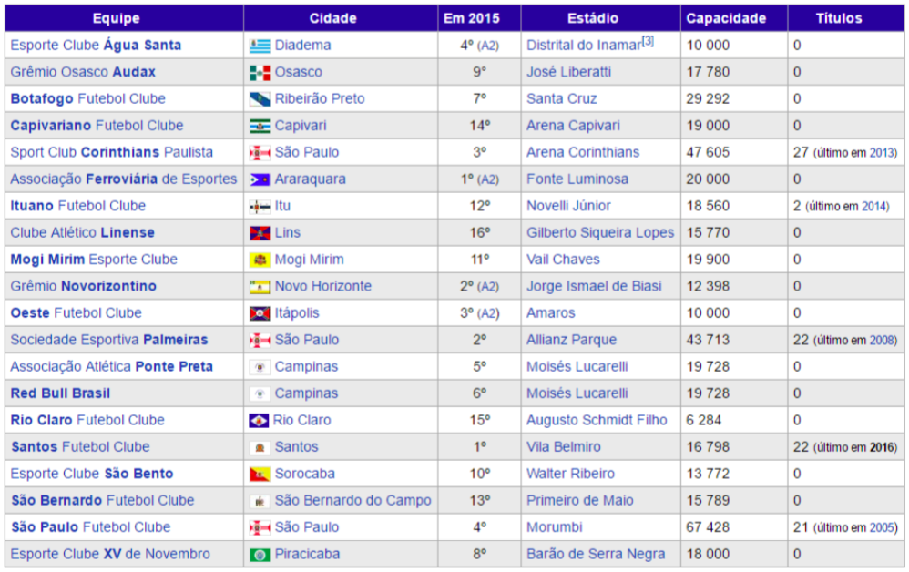
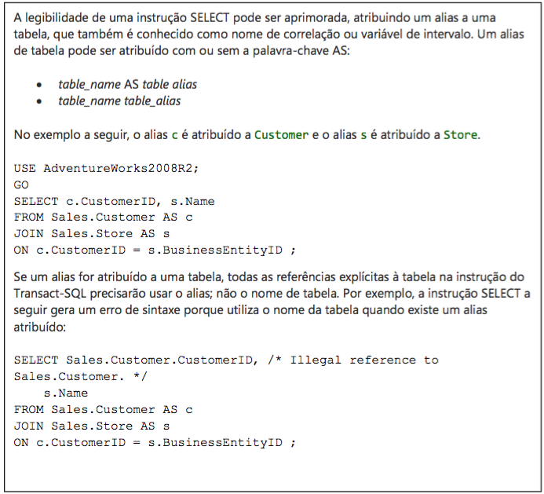

[Home](home.md) | Apresentação | [Banco de Dados](fase-01-bd.md) | [ Telas ](fase-01-telas.md)

# Bem-vindo à Fase 1!

Aqui descrevemos os detalhes do projeto para a avaliação 1 da matéria de Laboratório de Banco de Dados do Curso de Análise e Desenvolvimento de Software ministrada pelo Prof. M. Sc. Leandro Colevati dos Santos na FATEC Zona Leste no segundo semestre de 2016.

**Laboratório de Banco de Dados Fatec Zona Leste**

- Avaliação 1 Entrega em 26/09/2016

Prof. M. Sc. Leandro Colevati dos Santos

### APRESENTAÇÃO

O Campeonato Paulista de 2016 teve regras absolutamente esdrúxulas. Para se adequar a emissoras de tv, patrocinadores e jogadores, o campeonato foi organizado da seguinte maneira:

O "Paulistão" será disputado por 20 clubes, divididos em quatro grupos com cinco equipes
cada.

Os times que estão na mesma chave enfrentam apenas os clubes de outros grupos. No total, cada participante vai realizar 15 partidas na primeira fase. A primeira fase acontecerá a partir de 30 de janeiro.

Os dois melhores classificados de cada chave avançam às quartas de final, que será disputada, entre eles, em jogo único - com o mando de campo ao clube de melhor campanha no somatório das fases anteriores. Em caso de empate no tempo regulamentar, o confronto será decidido através de pênaltis.

A semifinal também será definida em apenas uma partida e com possibilidade de decisão por penais. Já a final acontecerá em dois jogos, e em caso de empate em pontos (uma vitória para cada time ou dois empates), o primeiro critério de desempate será o saldo de gols na fase final. Caso o empate persista, o confronto será decidido através de pênaltis. O gol marcado fora de casa não vale como critério de desempate.

Os quatro times que somarem menos pontos na primeira fase estarão rebaixados para a segunda divisão.

### ATIVIDADE

Fazer uma aplicação em Java (Web (Servlets) ou Desktop (Swing ou JavaFX)) com SQL Server para resolver os problemas, da seguinte maneira:

O sistema deve ter 3 tabelas principais:

- Times (Com todos os 20 times - não é necessário CRUD para ela)

```sql

Times (CodigoTime | NomeTime | Cidade | Estadio)
```

- Grupos
(Coritnthians, Palmeiras, Santos e São Paulo NÃO PODEM estar no mesmo grupo - a coluna Grupo não pode aceitar nenhum valor diferente de A, B, C, D)

```sql

Grupos (Grupo | CodigoTime)
```

- Jogos
(A primeira fase ocorrerá em 15 datas seguidas, sempre rodada cheia - os 10 jogos - aos domingos e quartas)

```sql

Jogos (CodigoTimeA | CodigoTimeB | GolsTimeA | GolsTimeB | Data)
```

O sistema deve se comportar da seguinte maneira:

- Uma tela deve chamar uma procedure que divide os times nos quatro grupos, preenchendo, aleatoriamente (com exceção da regra já exposta em Grupos).

- Uma tela deve gerar as rodadas dos jogos, de acordo com as regras do campeonato, preenchendo a tabela jogos.
Lembre-se, cada rodada tem 10 jogos (todos os 20 times). Lembre-se também que, as rodadas vão acontecer de quarta e domingo, sucessivamente, sem pausas.

- Uma tela deve mostrar 4 Tabelas com os 4 grupos formados.

- Uma tela deve mostrar um Campo, onde o usuário digite a data e, em caso de ser uma data com rodada, mostre uma tabela com todos os jogos daquela rodada.

### TABELA DE TIMES

(Não é necessário fazer o CRUD)



### DICAS

Para conhecimento, sempre é possível utilizar Alias em consultas tipo **JOIN** em SQL.
Normalmente, usamos Alias no nome da coluna (Ex.: **SELECT GETDATE() AS ‘Hoje’**). O “AS” determina o Alias.
No entanto, é possível se usar Alias no nome da tabela também. De acordo com a documentação Microsoft:



Um exemplo da obrigatoriedade do uso de Alias no nome da tabela, em um **Select** com **JOIN**, é quando mais de uma coluna da consulta faz referência à mesma tabela e à mesma **PK**.
